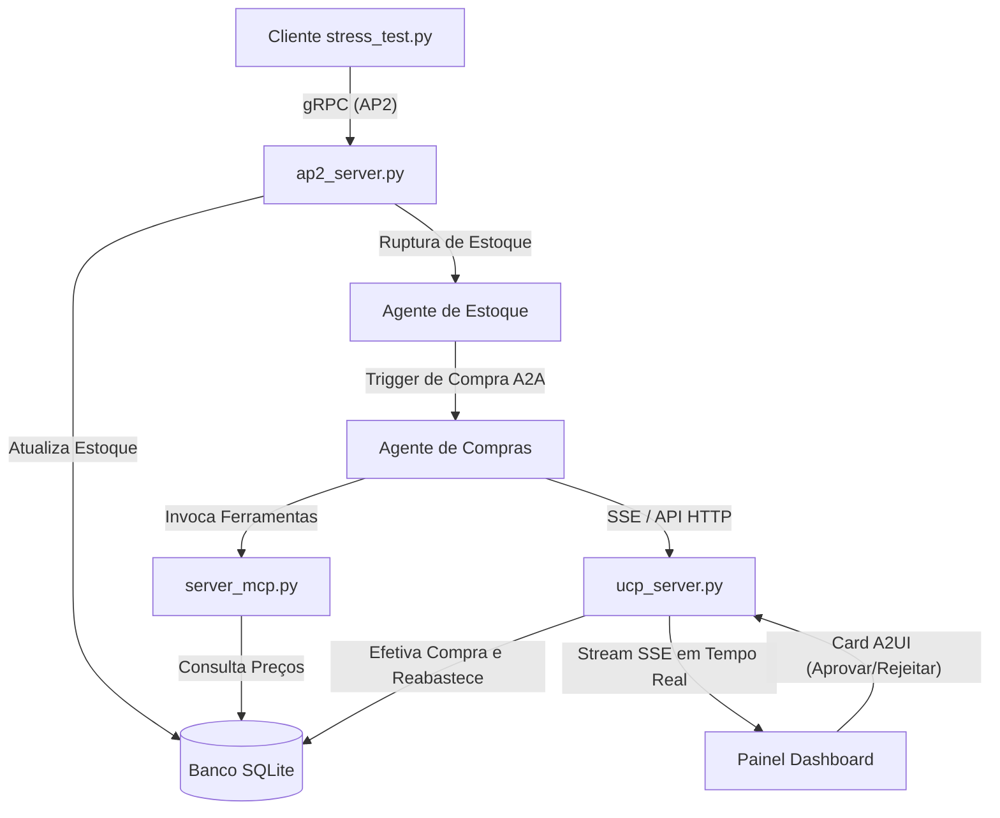

# PoC de Controle de Estoque em Tempo Real & Compras Agênticas (A2A)

Esta é uma Prova de Conceito (PoC) completa e integrada que demonstra uma **Malha de Agentes Distribuída e Orientada a Eventos** para monitoramento de estoque de hardware, cotação de fornecedores via IA e autorização de remessas financeiras em lote via Pix (Human-in-the-Loop).

---

## 🛠️ Arquitetura e Fluxo do Sistema

O sistema é construído sobre uma arquitetura distribuída em Python:

1. **Ingestão gRPC (AP2)**: O cliente simula demandas contínuas de estoque transmitindo eventos de consumo via gRPC na porta `50051`.
2. **Banco de Dados (SQLite)**: As deduções de estoque e tabelas financeiras são gravadas e mantidas em um banco SQLite local (`ucp_database.db`).
3. **Agente de Estoque & Comunicação A2A**: Quando o estoque atual cai abaixo do limite tolerável, o **Agente de Estoque** dispara uma requisição HTTP assíncrona despertando o **Agente de Compras** no orquestrador FastAPI.
4. **Camada de Inteligência (FastMCP)**: O Agente de Compras consulta o servidor MCP (`server_mcp.py`) para pesquisar fornecedores cadastrados, eleger o menor preço e agendar o pagamento da compra.
5. **Dashboard Glassmorphic & A2UI (Human-in-the-Loop)**: O painel web FastAPI escuta um canal SSE (`/api/events`) atualizando os dados dinamicamente. Quando a compra é agendada, um **Card A2UI** pulsante de autorização com a fotografia real do hardware aparece na tela.
6. **Remessa Pix em Lote**: Ao aprovar faturas, as transferências entram em uma fila Pix dedicada na aba lateral da interface. Clicando em "Exportar Lote", o sistema compila os arquivos CSV e JSON formatados com data e hora individual na pasta `exports/`.



---

## 📂 Organização do Projeto

* `ucp_db.py`: Módulo utilitário SQLite de tabelas e reabastecimento.
* `ap2_server.py`: Servidor gRPC responsável pela ingestão de demandas e disparo A2A.
* `server_mcp.py`: Servidor FastMCP que expõe as ferramentas agênticas de consulta e transações.
* `ucp_server.py`: Servidor FastAPI encarregado das comunicações, SSE e APIs REST.
* `static/index.html` & `app.js`: Interface web com desfoque glassmorphism, logs dinâmicos e abas de controle de Fila Pix.
* `static/images/`: Imagens reais de estúdio de alta fidelidade para cada componente de hardware.
* `pix_exporter.py`: Módulo utilitário para exportar remessas de Pix formatadas em CSV/JSON.
* `stress_test.py`: Injetor gRPC de simulação de demandas contínuas de estoque.

---

## 🚀 Como Executar Localmente no Windows

### 1. Criar o Ambiente Virtual e Instalar Dependências
```powershell
# Criar o virtualenv
python -m venv .venv

# Ativar o virtualenv
.venv\Scripts\Activate.ps1

# Instalar dependências
pip install fastapi uvicorn grpcio grpcio-tools mcp sse-starlette httpx
```

### 2. Iniciar os Servidores em Background
Inicie três terminais separados e rode os seguintes comandos:

- **Terminal 1 (Servidor gRPC AP2)**:
  ```powershell
  .venv\Scripts\python.exe ap2_server.py
  ```
- **Terminal 2 (Orquestrador FastAPI UCP)**:
  ```powershell
  .venv\Scripts\python.exe ucp_server.py
  ```
- **Terminal 3 (Servidor FastMCP)**:
  ```powershell
  .venv\Scripts\python.exe server_mcp.py
  ```

### 3. Acessar o Dashboard
Abra o navegador no link: **[http://localhost:8000](http://localhost:8000)**.

### 4. Simular Rupturas de Estoque
No terminal da sua workspace, execute o cliente de simulação:
```powershell
.venv\Scripts\python.exe stress_test.py
```
Aprove os cards na tela e exporte a remessa de lotes Pix em formato CSV/JSON com data e hora individual na aba lateral!
