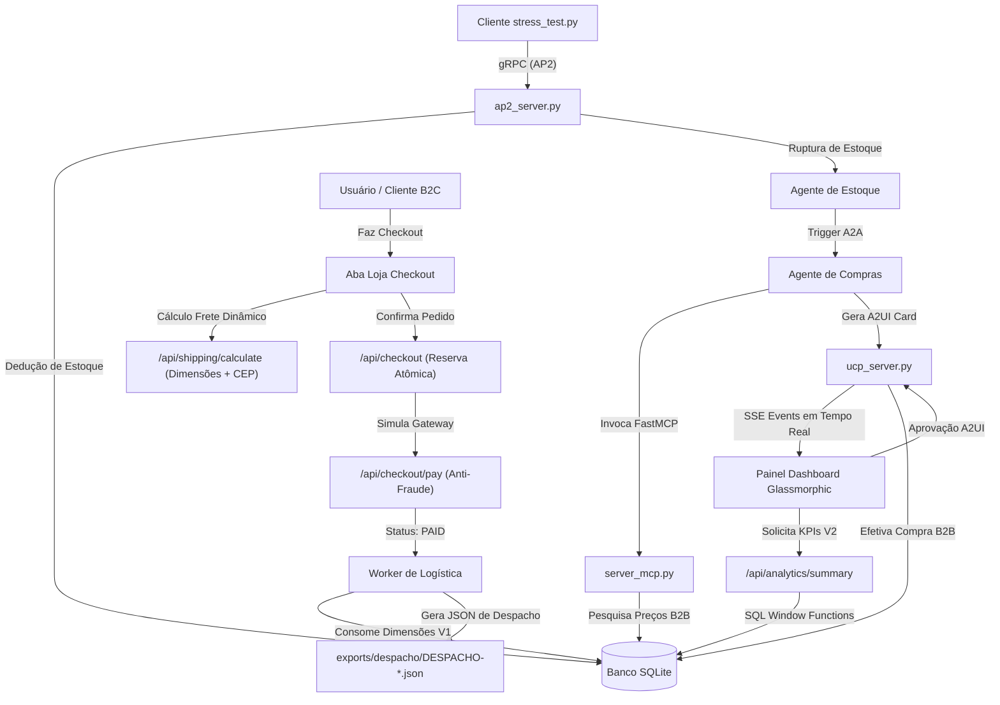

# PoC de Controle de Estoque em Tempo Real, Compras Agênticas & E-commerce V2 (A2A & B2C)

Esta é uma Prova de Conceito (PoC) completa e integrada de uma **Malha de Agentes Distribuída, Orientada a Eventos e Omnichannel**. O sistema combina monitoramento de estoque de hardware B2B com cotação automatizada via IA, autorização financeira com supervisão humana (*Human-in-the-Loop*), e um ecossistema completo de **E-commerce B2C com Logística Automatizada e Analytics em Tempo Real (Versão 2)**.

---

## 🛠️ Arquitetura e Fluxo do Sistema

O sistema é modular e distribuído em Python, estruturado em duas grandes frentes operacionais:

### 1. Fluxo de Reposição Agêntica B2B (Versão 1)
* **Ingestão gRPC (AP2)**: O cliente (`stress_test.py`) simula demandas contínuas de estoque transmitindo eventos de consumo via gRPC na porta `50051`.
* **Monitoramento & Alerta**: Quando o estoque físico cai abaixo do limite mínimo, o **Agente de Estoque** dispara um gatilho para o orquestrador FastAPI (`ucp_server.py`).
* **Camada de Inteligência (FastMCP)**: O **Agente de Compras** é despertado e invoca ferramentas no servidor MCP (`server_mcp.py`) para consultar preços entre fornecedores cadastrados e selecionar o melhor custo-benefício.
* **A2UI & Autorização Human-in-the-Loop**: Um card interativo pulsante contendo a foto real do hardware é enviado ao painel web via SSE. O operador humano aprova ou rejeita a compra.
* **Remessa Pix em Lote**: Ao aprovar a fatura, os pagamentos entram em uma fila Pix. Clicando em "Exportar Lote", o sistema gera remessas formatadas (CSV/JSON) em `exports/` com data e hora individuais.

### 2. Fluxo de E-commerce, Logística & Analytics (Versão 2)
* **Checkout de Loja Integrado**: Os usuários podem simular compras na aba **Loja Checkout**, selecionando hardwares e inserindo dados de faturamento.
* **Prevenção de Race Conditions**: A gravação do pedido aplica uma reserva de estoque atômica (`reserve_stock_atomic` em `ucp_db.py`) direto no banco SQLite, garantindo consistência em alta concorrência.
* **Cálculo de Frete Dinâmico**: Integração logística síncrona que calcula frete e busca endereço regional via CEP, combinando dados físicos de peso e dimensões tridimensionais (altura, largura, comprimento) herdados do catálogo de produtos.
* **Gateway Multifase & Anti-Fraude**: Processamento simulado de Pix (com expiração curta), Boleto Bancário e Cartão de Crédito (com validação anti-fraude síncrona baseada na integridade do CPF).
* **Worker de Despacho Logístico**: Após confirmação de pagamento, um worker assíncrono calcula a cubagem total em $m^3$ e peso acumulado do pedido, gravando um payload estruturado para a transportadora em `exports/despacho/DESPACHO-{id_pedido}.json`.
* **Dashboard de Inteligência com Window Functions**: A aba **KPI Analítico** exibe faturamento acumulado, ticket médio, taxa de conversão de checkout e giros de estoque ativos, gerados via consultas agregadas e funções de janela SQL (`SUM(valor_total) OVER (...)`).

---

## 📊 Diagrama de Fluxo Geral



---

## 📂 Organização do Projeto

* `ucp_db.py`: Modelagem de dados estendida com suporte a dimensões tridimensionais, tabelas de `pedidos` e `itens_pedido`, e agregação analítica via funções de janela.
* `ucp_server.py`: Servidor FastAPI orquestrando rotas SSE, fluxo de compras agênticas, checkout B2C, cálculo de frete, gateway multifase e background worker de logística.
* `ap2_server.py`: Servidor gRPC responsável pela ingestão de demandas e trigger inicial de reposição B2B.
* `server_mcp.py`: Servidor FastMCP que expõe as ferramentas agênticas de consulta de preços e agendamento de compras B2B.
* `static/index.html` & `app.js`: Interface moderna (desfoque glassmorphism) com abas reativas para Monitoramento de Estoque, Fila Pix, Loja E-commerce e KPI Analítico.
* `static/images/`: Banco de fotos reais de estúdio de alta fidelidade para os hardwares.
* `pix_exporter.py`: Utilitário para compilação e exportação de lotes Pix autorizados.
* `stress_test.py`: Injetor gRPC de simulação de demandas contínuas de estoque.

---

## 🚀 Como Executar Localmente no Windows

### 1. Criar o Ambiente Virtual e Instalar Dependências
```powershell
# Criar o virtualenv
python -m venv .venv

# Ativar o virtualenv
.venv\Scripts\Activate.ps1

# Instalar dependências
pip install fastapi uvicorn grpcio grpcio-tools mcp sse-starlette httpx
```

### 2. Iniciar os Servidores em Background
Inicie três terminais separados com o ambiente virtual ativado:

* **Terminal 1 (Servidor gRPC AP2)**:
  ```powershell
  python ap2_server.py
  ```
* **Terminal 2 (Orquestrador FastAPI UCP)**:
  ```powershell
  python ucp_server.py
  ```
* **Terminal 3 (Servidor FastMCP)**:
  ```powershell
  python server_mcp.py
  ```

### 3. Acessar o Dashboard
Abra o navegador no link: **[http://localhost:8000](http://localhost:8000)**.

### 4. Simular Cenários Operacionais

* **Cenário A: E-commerce B2C e Despacho Logístico**
  1. Acesse a aba **Loja Checkout** no painel.
  2. Escolha um produto, digite um CEP válido (ex: `01310-100` ou `20000-000`) e clique em **Calcular** para obter o frete dinâmico baseado em peso e volume.
  3. Preencha os dados de checkout, selecione a forma de pagamento e clique em **Confirmar e Fechar Pedido**.
  4. Na tela do gateway de pagamento, clique em **Confirmar**.
  5. Veja no log o processamento do **Worker de Logística** e verifique na pasta `exports/despacho/` o arquivo JSON estruturado criado para a transportadora.
  6. Navegue até a aba **KPI Analítico** para analisar as métricas consolidadas via SQL.

* **Cenário B: Reposição B2B Agêntica**
  1. Com o dashboard aberto na aba **Estoque**, abra um novo terminal e rode a simulação:
     ```powershell
     python stress_test.py
     ```
  2. Quando um SKU sofrer ruptura, o **Agente de Estoque** acionará o **Agente de Compras** (FastMCP).
  3. Você verá o log agêntico rodando no console e um **Card A2UI** pulsando com a foto real do produto para sua autorização.
  4. Aprove o card, navegue até a aba **Fila Pix**, e exporte o lote CSV/JSON de pagamento gerado.
