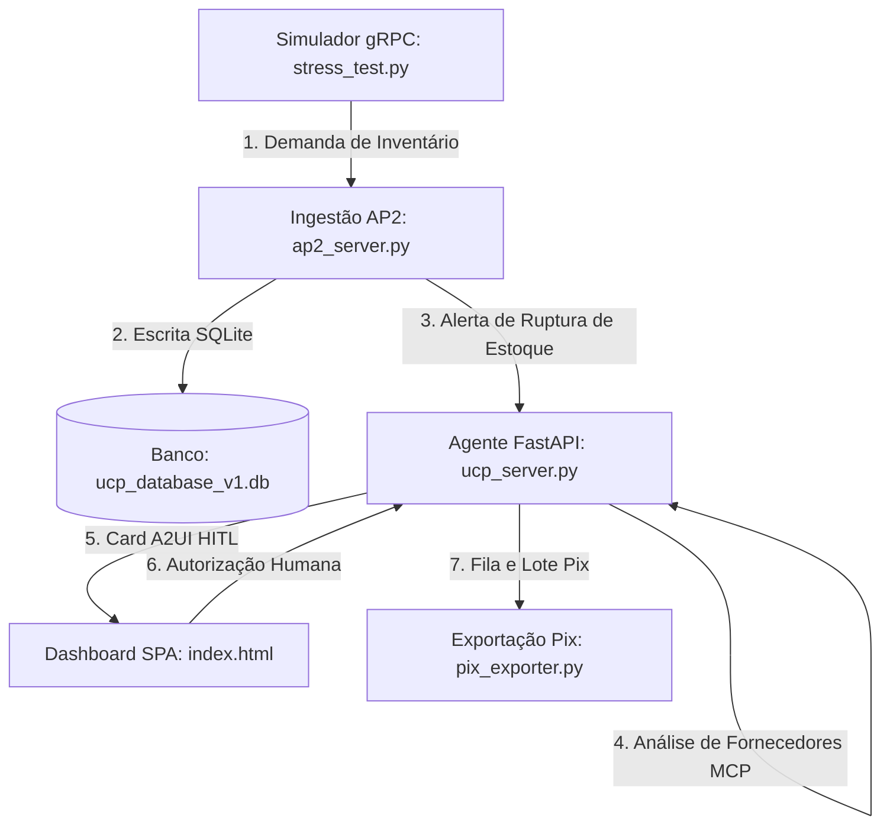

# 📖 Playbook de Operações: Universal Control Plane (UCP) V1 Clean

Este Playbook serve como o manual definitivo de arquitetura, operação e engenharia para a **Versão 1 (B2B)** simplificada e ultra-veloz do **Universal Control Plane (UCP)**.

Ele orienta sobre como configurar, operar e validar o cockpit inteligente de estoque B2B, a integração de segurança humano-no-loop (A2UI) e a rotina de estresse de inventário via gRPC de forma **100% isolada**.

---

## 🧭 1. Visão Geral do Sistema B2B

Esta versão limpa foca estritamente no ciclo transacional de suprimentos no atacado (B2B), sem acoplamentos com canais de vendas ao consumidor (B2C), impostos logísticos complexos ou despacho de fretes físicos:



---

## 🏗️ 2. Componentes e Estrutura do Projeto

O projeto é 100% autossuficiente e está contido na pasta raiz `ucp_v1_clean/`:

* **`ucp_db.py`**: Helper de acesso ao banco SQLite isolado `ucp_database_v1.db`. Cria e gerencia as tabelas `products`, `suppliers`, `purchases` e `pix_batches`.
* **`pix_exporter.py`**: Consolidador financeiro que converte compras B2B aprovadas em lotes Pix formatados em CSV (Internet Banking) e JSON (Integração API Bancária).
* **`ucp_server.py`**: Servidor FastAPI (porta `8000`) que expõe a API do dashboard, hospeda o canal SSE (Server-Sent Events) para atualizações em tempo real e orquestra o **Agente de Compras B2B** em segundo plano.
* **`ap2_server.py`**: Servidor gRPC de alta performance (porta `50051`) que recebe as baixas de estoque, realiza a concorrência atômica no SQLite e avisa o servidor web principal em caso de ruptura de estoque.
* **`stress_test.py`**: Script de teste que simula baixas rápidas e contínuas no estoque físico via requisições gRPC.
* **`static/`**:
  * `index.html`: Interface glassmorphic dark-mode com as abas de estoque e lotes Pix.
  * `app.js`: Script cliente otimizado com **DOM cirúrgico**, **log capping (150 logs)** e **lazy-loading buffer** para reatividade extrema.

---

## 🎮 3. Instruções de Execução (Como Rodar o Cockpit)

Para colocar o ecossistema inteiro para rodar em tempo real e visualizar o ciclo fechado das operações, execute os seguintes passos em terminais separados (garantindo que o ambiente virtual `.venv` esteja ativado e que você esteja no diretório `ucp_v1_clean/`):

### Passo 1: Ativar Ambiente e Acessar Diretório
Abra seus terminais e garanta que você está na pasta correta:
```powershell
cd c:\Users\rcruz\Downloads\agv_prj_a2a\ucp_v1_clean
```

*(Se aplicável, certifique-se de ativar o ambiente `.venv` na raiz antes de executar os python scripts)*:
```powershell
..\.venv\Scripts\Activate.ps1
```

### Passo 2: Subir o Servidor gRPC AP2 (Ingestão)
Este servidor lida com as baixas de estoque de alta performance.
```powershell
python ap2_server.py
```
*Saída esperada:* `🚀 Servidor gRPC AP2 de Ingestão de Demanda escutando na porta 50051`

### Passo 3: Subir o Servidor UCP Principal (FastAPI)
Abra outro terminal, acesse a pasta, ative o `.venv` e inicie o backend FastAPI:
```powershell
python ucp_server.py
```
*Saída esperada:* `🚀 Iniciando Servidor FastAPI UCP V1 Clean em http://localhost:8000`

### Passo 4: Acessar a Interface Gráfica
* Abra o seu navegador e acesse: **`http://localhost:8000`**
* Você verá a belíssima interface em glassmorphism reativa em tempo real.

### Passo 5: Iniciar o Simulador de Estresse de Estoque (gRPC)
Abra outro terminal, acesse a pasta, ative o `.venv` e ative a rotina de depleção:
```powershell
python stress_test.py
```
*Saída esperada:* Transmissão gRPC periódica de consumos e simulação de rupturas contínuas nos 4 produtos.

---

## ⚡ 4. Lógica de Otimizações de Reatividade no Frontend (`app.js`)

Para manter o painel rodando com extrema suavidade (60 FPS) sob testes de estresse gRPC severos, implementamos as seguintes melhorias na lógica do cliente HTML5:

1. **DOM Cirúrgico (Otimização de Inventário)**:
   * Evita a recriação de cards HTML inteiros usando `innerHTML = ""`.
   * A função `updateStockGrid` busca os cartões por SKU ID (`#card-SKU-001`). Se já existirem, atualiza cirurgicamente apenas as propriedades `.innerText` do número e `.style.width` da barra de progresso, poupando CPU e reflows do navegador.
2. **Console Capping (Corte do Console)**:
   * Limita a renderização a no máximo **150 logs** no console de atividade. Logs antigos são removidos do topo da árvore do DOM dinamicamente, mantendo o renderizador do navegador leve.
3. **Lazy Log Processing (Processamento Preguiçoso)**:
   * Quando o operador está olhando a aba **Lote Pix Aguardando**, a re-renderização visual dos logs no console é totalmente **pausada** para poupar CPU.
   * Os logs continuam sendo salvos silenciosamente em um buffer de memória de alta velocidade (`logHistoryBuffer = []`).
   * Ao retornar para a aba **Monitor de Estoque**, o painel de console reconstrói instantaneamente a pilha a partir do buffer em milissegundos.
